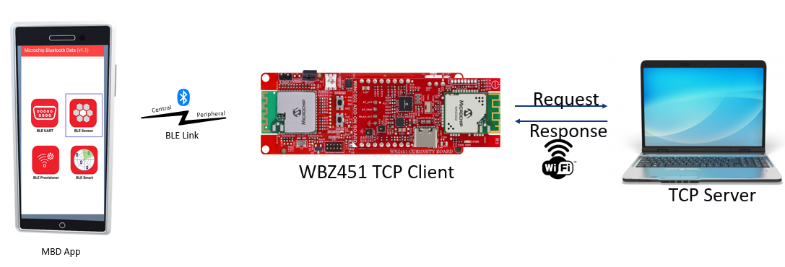

# PIC32CXBZ2 WBZ45x WINCS02 WiFi Provisioning via BLE

> "IoT Made Easy!" 

Devices: **| WBZ451 | WINCS02 |** 
Features: **| Wi-Fi | BLE |**

## ⚠ Disclaimer

<b>
THE SOFTWARE ARE PROVIDED "AS IS" AND GIVE A PATH FOR SELF-SUPPORT AND SELF-MAINTENANCE. This repository contains example code intended to help accelerate client product development.  

For additional Microchip repos, see: <a href="https://github.com/Microchip-MPLAB-Harmony" target="_blank">https://github.com/Microchip-MPLAB-Harmony</a>

Checkout the <a href="https://microchipsupport.force.com/s/" target="_blank">Technical support portal</a> to access our knowledge base, community forums or submit support ticket requests.

</b>

## Contents

1. [Introduction](#step1)
1. [Bill of materials](#step2)
1. [Software Setup](#step3)
1. [Hardware Setup](#step4)
1. [Harmony MCC Configuration](#step5)
1. [Board Programming](#step6)
1. [Run the demo](#step7)

## 1. Introduction<a name="step1">

This application demonstrates how to provision a device to a WiFi network via BLE and open a TCP client in Host Companion mode using the WBZ451 Curiosity board. In this application, the WINCS02 module will host a TCP client in Wi-Fi STA mode. Users can either pre-configure the Wi-Fi credentials for their Home-AP or provision them through BLE using the Microchip Bluetooth Data (MBD) app.

To ensure proper remote TCP server configuration, provide the necessary details. By default, the application will connect to the Home-AP and initiate a TCP client socket connection with a TCP server. Once a successful TCP server-client connection is established, data exchange will commence.

Users can utilize the "Microchip Bluetooth Data" mobile application to send the AP credentials to the WINCS02 module via a custom BLE service created on the WBZ451 device.

 

## 2. Bill of materials<a name="step2">

| TOOLS | QUANTITY |
| :- | :- |
| [PIC32CX-BZ2 and WBZ451 Curiosity Development Board](https://www.microchip.com/en-us/development-tool/ev96b94a) | 1 |
| [WINCS02 Add-on Board](https://www.microchip.com/en-us/development-tool/ev68g27a) | 1 |

## 3. Software Setup<a name="step3">

- [MPLAB X IDE ](https://www.microchip.com/en-us/tools-resources/develop/mplab-x-ide#tabs)

    - Version: 6.20
	- XC32 Compiler v4.45
	- MPLAB® Code Configurator v5.5.1
	- PIC32MZ-W_DFP v1.4.243
	- MCC Harmony
		- wireless_system_rnwf: v3.0.0
		- wireless_wifi: v3.12.0"}
		- csp: v3.19.7
		- core: v3.14.0
		- wireless_pic32cxbz_wbz: v1.4.0
		- wireless_ble: v1.3.0
		- wireless_system_pic32cxbz_wbz: v1.6.0
		- CMSIS_5: 5.9.0
		- FreeRTOS-Kernel: v11.1.0
		- wolfssl: v5.4.0
		- crypto: v3.8.2

- Any Serial Terminal application like [TERA TERM](https://download.cnet.com/Tera-Term/3000-2094_4-75766675.html) terminal application

- [MPLAB X IPE v6.20](https://microchipdeveloper.com/ipe:installation)

## 4. Hardware Setup<a name="step4">

- In the WBZ451 Curiositiy board please remove the resistor R122 and R124. Mount the WINCS02 Add on board on WBZ451 Curiosity board. 

## 5. Harmony MCC Configuration<a name="step5">

### Getting started with TCP Client application in WBZ451 Curiosity board 

| Tip | New users of MPLAB Code Configurator are recommended to go through the [overview](https://onlinedocs.microchip.com/pr/GUID-1F7007B8-9A46-4D03-AEED-650357BA760D-en-US-6/index.html?GUID-B5D058F5-1D0B-4720-8649-ACE5C0EEE2C0) |
| :- | :- |

**Step 1** - Connect the WBZ451 Curiosity board setup to the device/system using a micro-USB cable.

**Step 2** - Create a new MCC Harmony project.

**Step 3** - The "MCC - Harmony Project Graph" below depicts the harmony components utilized in this project.

- From device resources go to Wireless->Drivers->BLE->Services and select Customized Service. Accept all dependencies. The configuration is depicted as follows.

- From Project graph, select BLE Stack. The configuration is depicted as follows.

- From device resources go to Wireless->Drivers and select WINCS02. Right click on SPI and select SERCOM1. Right click on SYS_DEBUG and select DEBUG. Accept all dependencies. The configuration is depicted as follows.

- Right click on TMR in TIME component and add TC0.

- Right click on SYS_CONSOLE in DEBUG component and add SERCOM 0.

- From device resources go to Wireless->System Services and select RNWF WINCS Net Service. Accept all dependencies. The configuration is depicted as follows.

- From device resources go to Wireless->System Services and select RNWF WINCS Wi-Fi Service. Accept all dependencies. The configuration is depicted as follows.

- From device resources go to Harmony->Peripherals and select EIC. The configuration is depicted as follows.

- From Plugins, select Pin configuration. The configuration is depicted as follows.

**Step 4** -   [Generate](https://onlinedocs.microchip.com/pr/GUID-A5330D3A-9F51-4A26-B71D-8503A493DF9C-en-US-1/index.html?GUID-9C28F407-4879-4174-9963-2CF34161398E) the code.

**Step 5** -  Copy the mentioned files from this repository by navigating to the location mentioned below and replace the generated files.
 
| Note | This application repository should be cloned/downloaded to perform the following steps. |
| :- | :- |
| Path | The application folder can be found in the following [link](https://github.com/MicrochipTech/PIC32CXBZ2_WBZ45x_BLE_UART_MODBUS) |

- Copy the following files from the cloned repo(...\firmware\src).
	- "app.c" and "app.h",
	- "app_ble.c" and "app_ble.h",
	- "app_ble_handler.c" and "app_ble_handler.h"
	- "ble_conn_serv_svc.c" (\src\config\default\ble\service_ble\ble_cms\ble_conn_serv_svc.c)
	- wdrv_winc_sta.c(src\config\default\driver\wifi\wincs02\wdrv_winc_sta.c)
	- plib_gpio.h(src\config\default\peripheral\gpio\plib_gpio.h)
	- sys_console.h(\src\config\default\system\console\sys_console.h)
	- configuration.h(src\config\default\configuration.h)
	- freertos_hooks.c(\src\config\default\freertos_hooks.c)
	- "app_timer" folder
- Replace the above mentioned files in your project folder location(...\firmware\src).

**Step 6** - In "app_user_edits.c", make sure the below code line is commented 

- "#error User action required - manually edit files as described here".

**Step 6** - In "configurations.h", please change the IP address under the below definition to the IP address running the TCP Server script. (src\config\default\configuration.h)

'''
SYS_WINCS_NET_SOCK_SERVER_ADDR0
'''

**Step 7** - From projects, go to "app_adv.h" file and add this code in line 104.

**Step 8** - Clean and build the project. To run the project, select "Make and program device" button.

## 6. Board Programming<a name="step6">

### Program the precompiled hex file using MPLAB X IPE

- The application hex file can be found in the hex folder.

- Follow the steps provided in the link to [program the precompiled hex file](https://microchipdeveloper.com/ipe:programming-device) using MPLABX IPE to program the pre-compiled hex image. 

### Build and program the application using MPLAB X IDE

Follow the steps provided in the link to [Build and program the application](https://github.com/Microchip-MPLAB-Harmony/wireless_apps_pic32cxbz2_wbz45/tree/master/apps/ble/advanced_applications/ble_sensor#build-and-program-the-application-guid-3d55fb8a-5995-439d-bcd6-deae7e8e78ad-section).

## 7. Run the demo<a name="step7">

- On startup, go to MBD app->BLE provisioning->WINC3400. 

- Scan and connect to "WINCS02_Keystream" device. 

- Pair the device by entering the key displayed in Tera-Term. 

- Enter the details of the Wi-Fi SSID and password and select provision. 

- The device will be connected to the configured Wi-Fi network. 

- For TCP server, please run the script given. Make sure the device running the script is also connected to the same Wi-Fi network and this device IP address is updated in the application as mentioned earlier. 

- Once the TCP connection is established the messages sent from the TCP Server will be printed on TCP Client console.

 

- If the application code is already configured to the Wi-Fi settings then the application will get connected and will start receiving messages from the TCP server.
